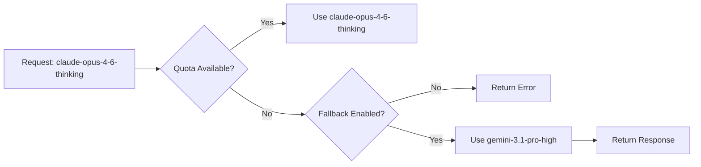

Model fallback enables graceful degradation when all accounts exhaust quota for a specific model. The proxy automatically switches to an alternate model with similar capabilities.

## What is Model Fallback?

When enabled, the proxy monitors quota exhaustion across all accounts. If every account runs out of quota for a requested model, the proxy automatically falls back to a pre-configured alternate model instead of returning an error.

<Note>
Fallback is **disabled by default**. Enable it with the `--fallback` flag or `FALLBACK=true` environment variable.
</Note>

### Why Use Fallback?

<CardGroup cols={2}>
  <Card title="Continuous Availability" icon="circle-check">
    Keep your workflow running even when quota is exhausted for your preferred model.
  </Card>
  
  <Card title="Automatic Recovery" icon="rotate">
    No manual intervention needed—the proxy handles failover automatically.
  </Card>
  
  <Card title="Similar Capabilities" icon="equals">
    Fallback models are chosen to match the original model's capabilities (thinking, performance tier).
  </Card>
  
  <Card title="Transparent Logging" icon="eye">
    The proxy logs when fallback occurs so you can monitor quota usage.
  </Card>
</CardGroup>

## Enabling Fallback

Enable fallback when starting the proxy:

<Tabs>
  <Tab title="CLI Flag">
    ```bash
    npm start -- --fallback
    ```
  </Tab>
  
  <Tab title="Environment Variable">
    ```bash
    FALLBACK=true npm start
    ```
  </Tab>
  
  <Tab title="Development Mode">
    ```bash
    npm run dev -- --fallback
    ```
  </Tab>
</Tabs>

<Warning>
Fallback is **disabled on recursive calls** to prevent infinite fallback chains.
</Warning>

## Fallback Mappings

The proxy uses pre-configured fallback mappings between models. Thinking models fall back to other thinking models to preserve reasoning capabilities.

### Claude → Gemini Fallback

<Steps>
  <Step title="claude-opus-4-6-thinking">
    Falls back to **gemini-3.1-pro-high**
    
    Both are high-capability thinking models optimized for complex reasoning.
  </Step>
  
  <Step title="claude-sonnet-4-5-thinking">
    Falls back to **gemini-3-flash**
    
    Both are balanced thinking models with good speed and capability.
  </Step>
  
  <Step title="claude-sonnet-4-5">
    Falls back to **gemini-3-flash**
    
    Fast, general-purpose models without extended thinking.
  </Step>
</Steps>

### Gemini → Claude Fallback

<Steps>
  <Step title="gemini-3.1-pro-high">
    Falls back to **claude-opus-4-6-thinking**
    
    High-performance thinking models for demanding tasks.
  </Step>
  
  <Step title="gemini-3.1-pro-low">
    Falls back to **claude-sonnet-4-5**
    
    Balanced models for general coding tasks.
  </Step>
  
  <Step title="gemini-3-flash">
    Falls back to **claude-sonnet-4-5-thinking**
    
    Fast thinking models optimized for iteration speed.
  </Step>
</Steps>

### Fallback Map Table

| Primary Model | Fallback Model |
|---------------|----------------|
| `gemini-3.1-pro-high` | `claude-opus-4-6-thinking` |
| `gemini-3.1-pro-low` | `claude-sonnet-4-5` |
| `gemini-3-flash` | `claude-sonnet-4-5-thinking` |
| `claude-opus-4-6-thinking` | `gemini-3.1-pro-high` |
| `claude-sonnet-4-5-thinking` | `gemini-3-flash` |
| `claude-sonnet-4-5` | `gemini-3-flash` |

## How Fallback Works

<Steps>
  <Step title="Request arrives">
    A request comes in for a specific model (e.g., `claude-opus-4-6-thinking`).
  </Step>
  
  <Step title="Quota check">
    The proxy checks all accounts for available quota on that model.
  </Step>
  
  <Step title="Exhaustion detected">
    If all accounts are exhausted or rate-limited for the requested model:
    
    - **Without fallback**: Return error to client
    - **With fallback**: Check if a fallback model exists
  </Step>
  
  <Step title="Fallback execution">
    The proxy:
    
    1. Logs the fallback event
    2. Retrieves the fallback model from the mapping
    3. Retries the request with the fallback model
    4. Returns the response to the client
  </Step>
</Steps>

### Example Scenario



## Use Cases

### Continuous Development

<CodeGroup>

```bash Scenario: Heavy Claude Usage
# Your team exhausts Claude Opus quota during peak hours
# Fallback automatically switches to Gemini 3.1 Pro High
# Development continues without interruption
```

```bash Scenario: Multi-Region Teams
# Asia-Pacific team uses up Gemini quota overnight
# European team starts work and automatically falls back to Claude
# No coordination needed between teams
```

</CodeGroup>

### Testing & CI/CD

<CodeGroup>

```bash CI Pipeline
# Run tests with fallback enabled
FALLBACK=true npm test

# Tests continue even if quota is exhausted
# No failed builds due to rate limits
```

```bash Load Testing
# Stress test with multiple models
FALLBACK=true npm start

# Automatically distributes load across model families
```

</CodeGroup>

### Production Resilience

```bash Production Deployment
# Enable fallback for high-availability setups
FALLBACK=true PORT=8080 npm start

# Ensure service continuity during quota exhaustion
```

## Monitoring Fallback Events

The proxy logs all fallback events for monitoring and debugging.

### Log Output

```log
[INFO] All accounts exhausted for claude-opus-4-6-thinking
[INFO] Falling back to gemini-3.1-pro-high
[SUCCESS] Fallback request completed successfully
```

### Checking Fallback Usage

In the Web Console:

1. Navigate to **Logs**
2. Filter for "fallback" events
3. Review which models triggered fallback
4. Monitor quota recovery times

<Tip>
Enable **Developer Mode** in Settings to see detailed fallback metrics and health scores.
</Tip>

## Limitations

<AccordionGroup>
  <Accordion title="Cross-model signature incompatibility">
    When falling back between Claude and Gemini, **thinking signatures may be incompatible** and will be dropped automatically.
    
    - Claude uses `signature` field
    - Gemini uses `thoughtSignature` field
    - The proxy detects incompatibility and cleans up signatures
    - May lose some conversation context during fallback
  </Accordion>
  
  <Accordion title="No recursive fallback">
    If the fallback model is also exhausted, the proxy returns an error instead of trying another fallback.
    
    **Example**:
    ```
    Request: claude-opus-4-6-thinking (exhausted)
    → Fallback: gemini-3.1-pro-high (also exhausted)
    → Return: Error (no secondary fallback)
    ```
  </Accordion>
  
  <Accordion title="Performance differences">
    Fallback models have similar but not identical capabilities:
    
    - Response quality may vary slightly
    - Speed/latency characteristics differ
    - Context window limits may differ
  </Accordion>
  
  <Accordion title="Quota consumption">
    Fallback uses quota from the alternate model's pool. If you frequently fall back, you may exhaust both model families.
    
    **Best practice**: Monitor quota usage and add accounts if fallback occurs frequently.
  </Accordion>
</AccordionGroup>

## Best Practices

<CardGroup cols={2}>
  <Card title="Monitor logs" icon="chart-line">
    Track fallback frequency to identify quota bottlenecks.
  </Card>
  
  <Card title="Add accounts" icon="users">
    If fallback occurs regularly, add more Google accounts to increase quota.
  </Card>
  
  <Card title="Use quota thresholds" icon="gauge-high">
    Set quota thresholds to switch accounts before exhaustion, reducing fallback needs.
  </Card>
  
  <Card title="Test both families" icon="vial">
    Regularly test with both Claude and Gemini to ensure fallback works as expected.
  </Card>
</CardGroup>

### Recommended Configuration

For production use with fallback:

```json ~/.config/antigravity-proxy/config.json
{
  "maxAccounts": 20,
  "globalQuotaThreshold": 0.10,
  "accountSelection": {
    "strategy": "hybrid",
    "quota": {
      "lowThreshold": 0.15,
      "criticalThreshold": 0.05
    }
  }
}
```

Start the proxy:

```bash
FALLBACK=true npm start
```

## Fallback API Reference

The fallback configuration is defined in `src/fallback-config.js` and `src/constants.js`.

### getFallbackModel()

Get the fallback model for a given primary model:

```javascript
import { getFallbackModel } from './fallback-config.js';

const fallback = getFallbackModel('claude-opus-4-6-thinking');
// Returns: 'gemini-3.1-pro-high'

const noFallback = getFallbackModel('unknown-model');
// Returns: null
```

### hasFallback()

Check if a model has a fallback configured:

```javascript
import { hasFallback } from './fallback-config.js';

const hasF = hasFallback('claude-sonnet-4-5-thinking');
// Returns: true

const noF = hasFallback('custom-model');
// Returns: false
```

### MODEL_FALLBACK_MAP

Direct access to the fallback mapping:

```javascript
import { MODEL_FALLBACK_MAP } from './constants.js';

console.log(MODEL_FALLBACK_MAP);
// {
//   'gemini-3.1-pro-high': 'claude-opus-4-6-thinking',
//   'claude-opus-4-6-thinking': 'gemini-3.1-pro-high',
//   ...
// }
```

## Troubleshooting

<AccordionGroup>
  <Accordion title="Fallback not triggering">
    Check that:
    
    1. Fallback is enabled (`--fallback` or `FALLBACK=true`)
    2. The requested model has a fallback mapping
    3. All accounts are actually exhausted (check `/account-limits`)
    4. Developer mode is enabled to see debug logs
  </Accordion>
  
  <Accordion title="Thinking signatures lost after fallback">
    This is expected behavior when switching between Claude and Gemini.
    
    - The proxy automatically cleans up incompatible signatures
    - Check logs for "signature cleanup" warnings
    - Use the same model family (all Claude or all Gemini) to preserve signatures
  </Accordion>
  
  <Accordion title="Still getting quota errors with fallback enabled">
    Possible causes:
    
    1. Both primary and fallback models are exhausted
    2. Fallback is disabled on recursive calls
    3. Account selection strategy is excluding all accounts
    
    **Solution**: Add more accounts or wait for quota to reset.
  </Accordion>
</AccordionGroup>

## Advanced: Custom Fallback Mappings

You can modify the fallback mappings by editing `src/constants.js`:

```javascript src/constants.js
export const MODEL_FALLBACK_MAP = {
  'gemini-3.1-pro-high': 'claude-opus-4-6-thinking',
  'gemini-3.1-pro-low': 'claude-sonnet-4-5',
  'gemini-3-flash': 'claude-sonnet-4-5-thinking',
  'claude-opus-4-6-thinking': 'gemini-3.1-pro-high',
  'claude-sonnet-4-5-thinking': 'gemini-3-flash',
  'claude-sonnet-4-5': 'gemini-3-flash',
  // Add custom mappings here
  'custom-model-1': 'custom-model-2'
};
```

<Warning>
Custom mappings require restarting the proxy. Test thoroughly before deploying to production.
</Warning>
